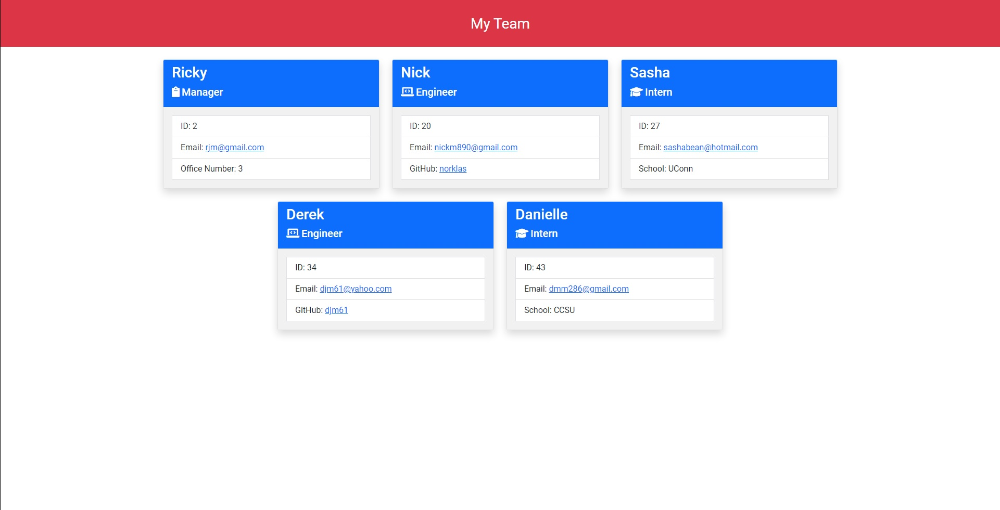

# Team Profile Generator

## Description

A **Node.js** CLI for generating a software engineering team page based on user input.

My motivation for this project was to get more familiar with how to use **Jest** for TDD, how to use object classes to create a library, and becoming more proficient with **Inquirer**. I built this project to quickly generate a software engineering team page with the **Node.js** CLI, this would be much quicker than creating the page, CSS, and JavaScript by hand.

I learned how to use the ternary operator more, as well as using **Jest** for TDD. I also became more proficient with creating object constructors, and object classes.

## Installation

To install this, type the following one at a time:

```
npm install, npm i inquirer
```

If testing is required, install:

```
npm i jest
```

## Usage

Type the following command to run the application:

```
node index.js
```

Then follow the prompts



[Video Demonstration](https://drive.google.com/file/d/1fVV8cweOLlwlhAPe5UeFdNhGGYPlm4lY/view)

## Tests

To test this application, type the following to install Jest:

```
npm i jest
```

Once that is done, simply type:

```
npm run test
```

## Credits

For email validation: [w3resource](https://www.w3resource.com/javascript/form/email-validation.php)

Bootstrap documentation: [Documentation](https://getbootstrap.com/docs/5.1/getting-started/introduction/)

FontAwesome documentation: [Documentation](https://fontawesome.com/docs)

Jest documentaiton: [Documentation](https://jestjs.io/docs/getting-started)

Google Fonts for typography: [Google Fonts](https://fonts.google.com/)

StackOverflow for Ternary isNaN: [StackOverflow Question](https://stackoverflow.com/questions/37051115/ternary-operator-isnan)